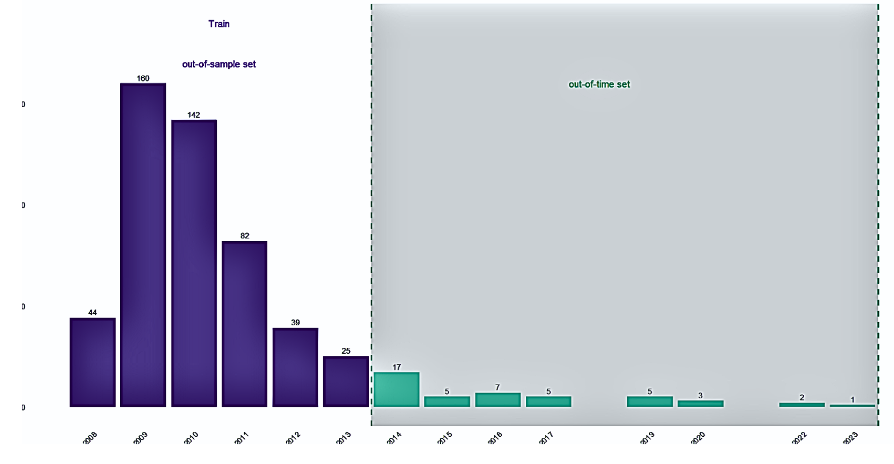
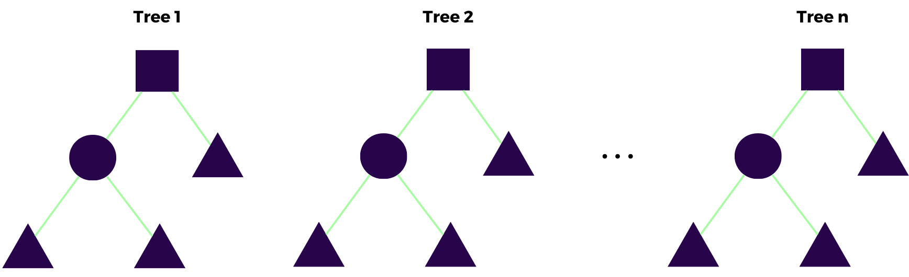
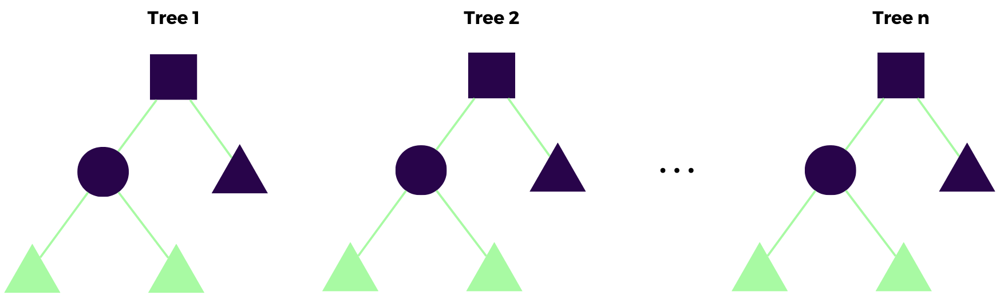
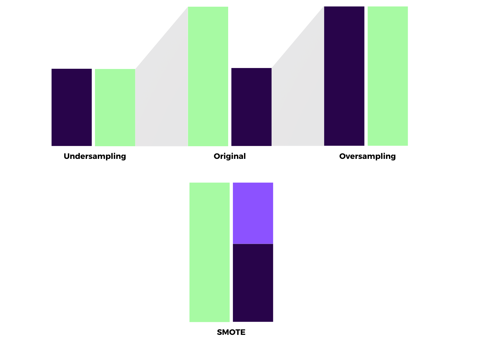

```{r, include=FALSE}
knitr::opts_chunk$set(echo = FALSE,
                      warning = FALSE,
                      tidy = FALSE,
                      message = FALSE,
                      fig.align = 'center',
                      out.width = "100%")
options(knitr.table.format = "html") 
```

```{=html}
<style>
#title {
  font-size: 110pt;
}

#main-img-left {
  width: 20%;
  left: 1in;
  bottom: 1.0in;
}

.main {
  background-color: #221132;
  background-image: linear-gradient(#221132 50%,#FFFFFF);
}

.main_bottom {
  background-color: #221132;
  background-image: linear-gradient(#FFFFFF 5%, #221132);
}

#author {
 font-size: 0.9em;
}


#main-img-right {
  width: 17%;
  right: 1in;
  bottom: 1.2in;
}

#references {
  font-size: 28px;
  line-height: 0.9;
}

</style>
```
# Introduction

Banks are crucial to the financial system and must operate effectively. Recently, bank failure models have been used to predict the likelihood of bank failures by analyzing relevant metrics. In addition to ensuring high out-of-sample performance, it is important to address the poor out-of-time performance of bank failure prediction models to maintain their utility `(Du Jardin & Séverin, 2011; Manthoulis et al., 2020)`. When using tabular data sets, deep learning models are used more than tree-based models `(Carmona et al., 2019); Petropoulos et al., 2020); Grinsztajn et al., 2022)`. As a difference, it is being examined what kind of results such data sets may encounter with Decision Trees, Random Forests `(Breiman, 2001)`, and Extra Trees `(Geurts et al., 2006)` models.

```{r, include=FALSE}
knitr::write_bib(c('posterdown', 'rmarkdown','pagedown'), 'packages.bib')
```

```{r figures, fig.cap='Failed Banks in the U.S. by years'}

```

The data has collected from the FDIC database using the **`{fdicdata}`** package in R `(Dar & Pillmore, 2023)`. It covers information about whether banks were active or closed within 15-year period from 2008 to 2023. When determining the time ranges in the data set, **in-sample** and **out-of-sample** were obtained between **2008-2014**, while models were builded using the **out-of-time** set between **2014-2023**. Figure \@ref(fig:figures) includes the banks that failed in the U.S. during these time ranges. CAMELS indicators (Capital, Asset Quality, Management Adequacy, Earnings, Liquidity, and Sensitivity to Market Risk) in the first as in `(Gogas et al. 2018)` and second variable groups as in `(Petropoulos et al. 2020)` were used. In the third variable group, different indicators that may be important were added. The variables in the data set are listed in detail in Figure \@ref(fig:variable) .

```{r, variable, out.width="75%", fig.cap='Details of variables used in the data set'}
knitr::include_graphics("variable_groups.png")
```

# Methods

Three different models were employed in this study because they provides varying variance of predictions. When comparing the prediction variances of these three methods, it becomes apparent that the **Decision Trees** yields high-variance predictions, the **Random Forests** provides predictions with moderate variance, and the **Extra Trees** generate predictions with low variance `(Gogas et al., 2018)`. The structures of Decision trees, Random forests and Extra trees models are shown in Figures \@ref(fig:rf), and \@ref(fig:ext). Random Forests lies in aggregating predictions generated by multiple decision trees. Breiman improved upon the overfitting-prone CART method by introducing Random Forests, an extension of bagging trees. It differs by using feature subsets for each tree, reducing correlation. This added randomness enhances stability and generalization, making Random Forests valuable across applications `(Breiman, 2000)`.

```{r rf, fig.cap='Random Forests Structure'}

```

Its two primary distinctions from Random Forests are that it splits nodes by randomly selecting cut-points and that it grows the trees using the entire learning sample `(Geurts et al., 2006)`.

```{r ext, fig.cap='Extra Trees Structure'}

```

To address imbalanced data, resampling techniques like **undersampling** reduce majority class samples, **oversampling** increases minority class samples, and **SMOTE** creates synthetic minority samples for better representation in Figure \@ref(fig:resampling).

```{r resampling,out.width="45%",fig.cap='Resampling Techniques’ Structures'}

```

# Results

Three different variable groups were considered, and three different models were applied. The dataset exhibited an imbalance between the classes. So, imbalance in the data was addressed using various resampling methods. **Accuracy** and **F1 scores** were calculated for each variable groups to assess model performance. The results of out-of-sample showed that generally the weighted-based which is cost-sensitive method had the highest accuracy for all variable groups, while SMOTE had the lowest accuracy. Accuracy values were closer between variable groups in the out-of-time strategy, and some results were the same in random forests and extra trees. Variable groups with under-sampling had lower F1 values in the out-of-time strategy. As a result, **the choice of resampling method's effectiveness varied depending on the variable group and model.** **The out-of-time strategy is important to assess how models perform with changing data over time.**

```{r, fig.cap='Accuracy and F1 values for out-of-sample with three different models for each variable group'}
knitr::include_graphics("out_of_sample_results.png")
```

```{r, fig.cap='Accuracy and F1 values for out-of-time with three different models for each variable group'}
knitr::include_graphics("out_of_time_results.png")
```

# Conclusion

In study focuses on using Decision Trees, Random Forests, and Extra Trees to make bank failure predictions. What makes this study apart is the usage of a **1-year lag (t-1) period** in the dataset. When examining the overall results of the models, **it was observed that Random Forests and Extra Trees yielded similar and high-quality results, making them the most effective models for predicting bank failures.**

# References

Breiman, L. (2000). Some infinity theory for predictor ensembles. Technical Report 579, Statistics Dept. UCB.

Breiman, L. (2001). Random forests. Machine learning, 45, 5-32.

Carmona, P., Climent, F., & Momparler, A. (2019). Predicting failure in the US banking sector: An extreme gradient boosting approach. Int. Rev. Econ. Finance, 61, 304-323.

Dar, U., & Pillmore, B. (2023). fdicdata: Accessing FDIC Bank Data. R package version 0.1.0.

Du Jardin, P., & Séverin, E. (2011). Predicting corporate bankruptcy using a self-organizing map: An empirical study to improve the forecasting horizon of a financial failure model. Decis Support Syst, 51(3), 701-711.

Geurts, P., Ernst, D., & Wehenkel, L. (2006). Extremely randomized trees. Machine learning, 63, 3-42.

Gogas, P., Papadimitriou, T., & Agrapetidou, A. (2018). Forecasting bank failures and stress testing: A machine learning approach. Int. J. Forecast., 34(3), 440-455.

Grinsztajn, L., Oyallon, E., & Varoquaux, G. (2022). Why do tree-based models still outperform deep learning on typical tabular data?. Adv. Neural Inf. Process, 35, 507-520.

Manthoulis, G., Doumpos, M., Zopounidis, C., & Galariotis, E. (2020). An ordinal classification framework for bank failure prediction: Methodology and empirical evidence for US banks. Eur. J. Oper. Res., 282(2), 786-801.

Petropoulos, A., Siakoulis, V., Stavroulakis, E., & Vlachogiannakis, N. E. (2020). Predicting bank insolvencies using machine learning techniques. Int. J. Forecast., 36(3), 1092-1113.
