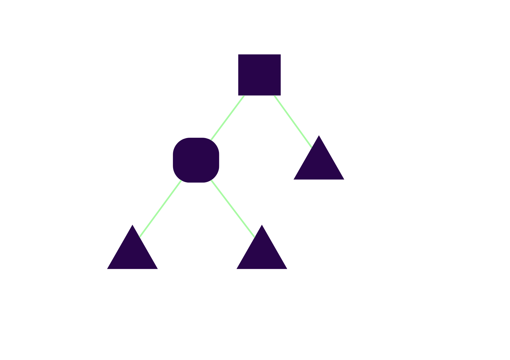

```{r, include=FALSE}
knitr::opts_chunk$set(echo = FALSE,
                      warning = FALSE,
                      tidy = FALSE,
                      message = FALSE,
                      fig.align = 'center',
                      out.width = "100%")
options(knitr.table.format = "html") 
```

# Introduction

Banks are crucial to the financial system and must operate effectively. Recently, bank failure models have been used to predict the likelihood of bank failures by analyzing relevant metrics. In addition to ensuring high out-of-sample performance, it is important to address the poor out-of-time performance of bank failure prediction models to maintain their utility (Du Jardin & Séverin, 2011, Manthoulis et al., 2020). When using tabular data sets, deep learning models are used more than tree-based models (Carmona et al., 2019; Petropoulos et al., 2020; Grinsztajn et al., 2022). As a difference, it is being examined what kind of results such data sets may encounter with decision trees, random forests, and extra trees models.

```{r, include=FALSE}
knitr::write_bib(c('posterdown', 'rmarkdown','pagedown'), 'packages.bib')
```

```{r, figures, out.width="500px", fig.retina = 1,fig.cap='Failed Banks in the U.S. by years'}
knitr::include_graphics("failed_banks_by_years.png")
```

The data has collected from the FDIC database using the {fdicdata} package in R (Dar & Pillmore, 2023). It covers information about whether banks were active or closed within 15-year period from 2008 to 2023. Three different variable groups were used, incorporating the CAMELS indicators (Capital, Asset Quality, Management Adequacy, Earnings, Liquidity, and Sensitivity to Market Risk) (Gogas et al., 2018; Petropoulos et al., 2020). When determining the time ranges in the data set, in-sample and out-of-sample were obtained between 2008-2014, while models were builded using the out-of-time set between 2014-2023. Figure 1 includes the banks that failed in the U.S. during these time ranges.

# Methods

Three different models were employed in this study because they provides varying variance of predictions. When comparing the prediction variances of these three methods, it becomes apparent that the Decision Trees yields high-variance predictions, the Random Forests provides predictions with moderate variance, and the Extra Trees generate predictions with low variance (Gogas et al., 2018). The structures of Decision trees, Random forests and Extra trees models are shown in Figure 2, Figure 3, and Figure 4.

```{r, dt, out.width="500px", fig.retina = 1,fig.cap='Decision Trees Structure'}

```

```{r, rf, out.width="500px", fig.retina = 1,fig.cap='Random Forests Structure'}
knitr::include_graphics("random_forests_structure.png")
```

Its two primary distinctions from Random Forests are that it splits nodes by randomly selecting cut-points and that it grows the trees using the entire learning sample (Geurts et al., 2006).

```{r, ext, out.width="500px", fig.retina = 1,fig.cap='Extra Trees Structure'}
knitr::include_graphics("extra_trees_structure.png")
```

```{r, resampling, out.width="500px", fig.retina = 1,fig.cap='Resampling Techniques’ Structures'}
knitr::include_graphics("resampling_methods.png")
```

Imbalanced data, with a majority and minority class, poses challenges for model training. To address this, resampling techniques like undersampling reduce majority class samples, oversampling increases minority class samples, and SMOTE creates synthetic minority samples for better representation in Figure 5.

# Results

Machine learning models were used to predict whether banks would fail or not in the U.S. Three different variable groups were considered, and three different models (decision trees, random forests, and extra trees) were applied. The dataset exhibited an imbalance between the classes. So, imbalance in the data was addressed using various resampling methods. Accuracy and F1 scores were calculated for each variable groups to assess model performance. The results of out-of-sample showed that generally the weighted-based which is cost-sensitive method had the highest accuracy for all variable groups, while SMOTE had the lowest accuracy. Accuracy values were closer between variable groups in the out-of-time strategy, and some results were the same in random forests and extra trees. Variable groups with under-sampling had lower F1 values in the out-of-time strategy. As a result, the choice of resampling method's effectiveness varied depending on the variable group and model. The out-of-time strategy is important to assess how models perform with changing data over time.

# Conclusion

This poster focuses on using Decision Trees, Random Forests, and Extra Trees to make bank failure predictions. What makes this study apart is the usage of a 1-year lag (t-1) period in the dataset. When examining the overall results of the models, it was observed that Random Forests and Extra Trees yielded similar and high-quality results, making them the most effective models for predicting bank failures.

# References

Gogas, P., Papadimitriou, T., & Agrapetidou, A. (2018). Forecasting bank failures and stress testing: A machine learning approach. International Journal of Forecasting, 34(3), 440-455.

Petropoulos, A., Siakoulis, V., Stavroulakis, E., & Vlachogiannakis, N. E. (2020). Predicting bank insolvencies using machine learning techniques. International Journal of Forecasting, 36(3), 1092-1113.

Dar, U., & Pillmore, B. (2023). fdicdata: Accessing FDIC Bank Data. R package version 0.1.0.
